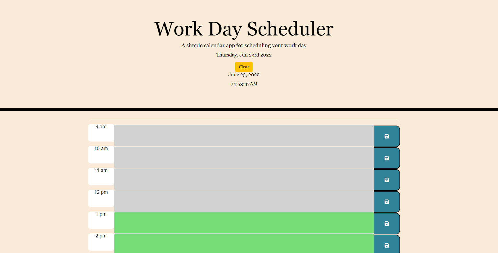

# Work Day Scheduler

Daily calendar application that allows a user to save events for each hour of the day. This app runs in the browser and features dynamically updated HTML and CSS powered by jQuery.

This app is especial for users with a busy schedule who need to organize their time effectively.

## Usage

This daily calendar displays time hours of the day between 9 AM - 5 PM.
The page's header displays the current day and date, along with the present time. The user also has a Clear bottom to reset the daily content of the calendar.
Each time block is color-coded to indicate whether it occurs in the past(gray), present(red), or future(green).
Each time block has an input field where users can save the information on the local storage.
This website is desktop and mobile compatible.

## Mock-Up

